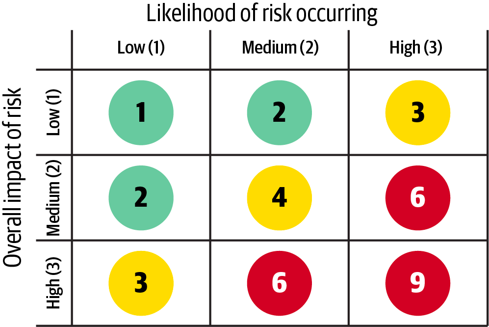

[> Home](README.md)  [> Problem Background](README.md) > Architectural Risks Assessment

[< Prev](1.6.RAID.md)  |  [Next >](1.7.MarketResearch.md)

---

# RAID Log

> A RAID log is a simple, effective project/program management tool to organize a project/program by tracking risks, actions, issues, and decisions
> RAID analysis focuses on four key areas:

## Risks

> events that can have an adverse impact if they occur.

- Compliant with law and regulation - All solutions must be law-abiding and compile with rules and guidance from regulatory bodies
- Personal data leak

## Assumptions

> things you assume are in place which contribute to the success of the project.
> Assumptions are the prerequisites an architecture. They are the things we believe to be completed or true.

### 1. Integration

* Diversity Cyber Council does not need to be integrated with the design of Spotlight platform at this stage.
  Although Diversity Cyber Council can join the platform as an NPO entity. Future extension of the platform could provide an option for listing and networking events api to made externally accessible and shown on DCC website.

### 2. Networking

* Networking functionality is for requirement for NPOs only and not for candidates.

### 3. Candidates

* No payment is required for use of services

### 4. Number of requests

According to [Market Research](1.7.MarketResearch.md) within the USA there are

* **1.5M** registered NPOs.
  Highly ambitious adoption goal of within first year of **1%** give us:
* **15k** NPOs onboarded
* **10** mentors/NPO, gives us
* **150k** mentors registered
* each mentor will have on average **3** mentees
* **450k** candidates
* each candidate will have **4** meeting per month
* Total of meetings per month **1,800,000**
* Avg. page request per meeting	**10**
* page requests per 18M/
* 6 working hours
* Peak Requests per second - **41.67**

**Conclusion** Initial number of requests will be relatively low.

### 5. Development team

* Development team is relatively small, and the proposed solution should enable fast time-to-market and ease of changes
* Development team is cross-functional and have experience with major technologies available on the market

## Issues

> Issues are the outstanding questions that have not been resolved.

* Project conceptual class/object model haven't been finalized
* RAID risk
* Limited time to deliver the initial architecture in this repository must be completed by 11:59pm Eastern time on Friday, June 3.

## Dependencies

> other projects or triggers that your project depends on, or are a beneficiary of your project outcomes.

- AWS - Vendor Lock-in 
- Headless CMS

---

[< Prev](1.6.RAID.md)  |  [Next >](1.7.MarketResearch.md)
