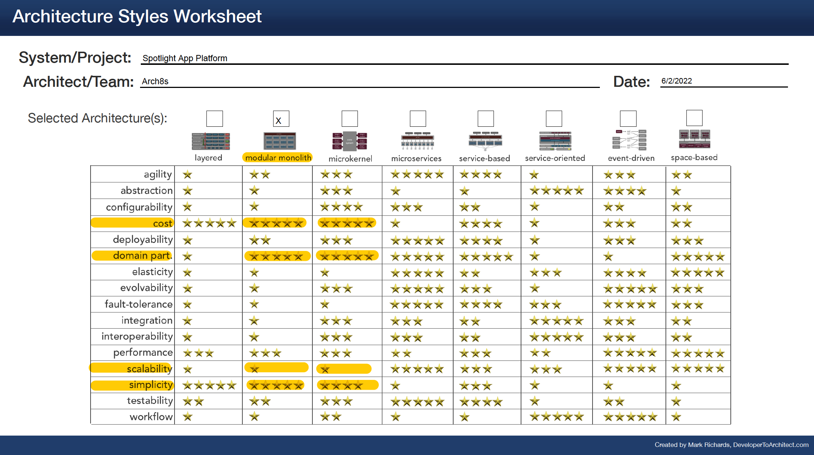
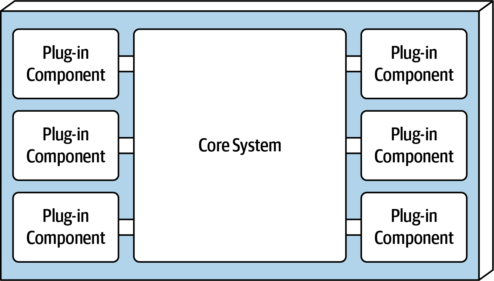

[> Home](../README.md)  [> Solution](README.md)

[< Prev](2.1.ArchitecturePrinciples.md)  |  [Next >](2.4.Security.md)

---

# Architecture Characteristics

## Key Architectural Characteristics
Using [Architecture characteristics worksheet](../assets/docs/spotlight-architecture-characteristics-worksheet.pdf).

We have [identified following architectural characteristics](../1.Problem/1.3.ArchitectureAnalysis.md), top 3 are marked with *:

* Simplicity *
* Cost *
* Domain partitioning 
* Scalability *

### Architecture Capabilities Comparison

The above key characteristics are highlighted below in yellow:

## Architecture Styles Analysis

The above matrix gives us tree candidates for our architecture, which need further analysis:

### Modular monolith

Overall cost and simplicity are the primary strengths of the layered architecture style.
Monolith broken into modules that can be developed independently can deliver many benefits while sidestepping many of the challenges of a microservice architecture, and can be the sweet spot for many organizations.

The benefits of a Modular Monolith approach over a normal Monolith are:

Reduced complexity: Each module only links to code that it specifically needs.
Easier to refactor: Changing a module has less or no effect on other modules.
Better for teams: Easier for developers to work on different parts of the code.

### Microkernel

The microkernel architecture style is a relatively simple monolithic architecture consisting of two architecture components: a core system and plug-in components. Application logic is divided between independent plug-in components and the basic core system, providing extensibility, adaptability, and isolation of application features and custom processing logic.

### Third-Party Black-Box Systems 

We can also consider some third-party software as monoliths that we may want to “decompose” as part of a migration effort. These might include things like payroll systems, CRM systems, and HR systems. The common factor here is that it’s software developed by other people, and you don’t have the ability to change the code. It could be off-the-shelf software you’ve deployed on your own infrastructure, or could be a Software-as-a-Service (SaaS) product you are using. Many of the decomposition techniques we’ll explore in this book can be used even with systems where you cannot change the underlying code.

## Conclusion

You also don’t have to all-in on a monolith or microservices. You can still split your application into parts that make sense — even following the guidelines of domain-driven design. With proper architecture, your code and modules can still be properly decoupled and your application can adhere to the 12-factor principles. These modules can be running in the same application, they can be sharing the same build pipeline and they can be deployed simply by just deploying one version.

All above architecture options have their trade-offs, but the trade-offs for the Modular Monolith architecture are lower overall.

### Decisions

ADRs: 
[ADR-007 We will use hybrid architecture](../5.ADRs/ADR-007-hybrid-architecture.md)
[ADR-012 We will use 12-factor application principles](../5.ADRs/ADR-012-12-factor-application-principles.md)

### Further reading

[Architecture styles worksheet by developertoarchitect.com](https://www.developertoarchitect.com/downloads/architecture-styles-worksheet.pdf)

---

[< Prev](2.1.ArchitecturePrinciples.md)  |  [Next >](2.4.Security.md)
