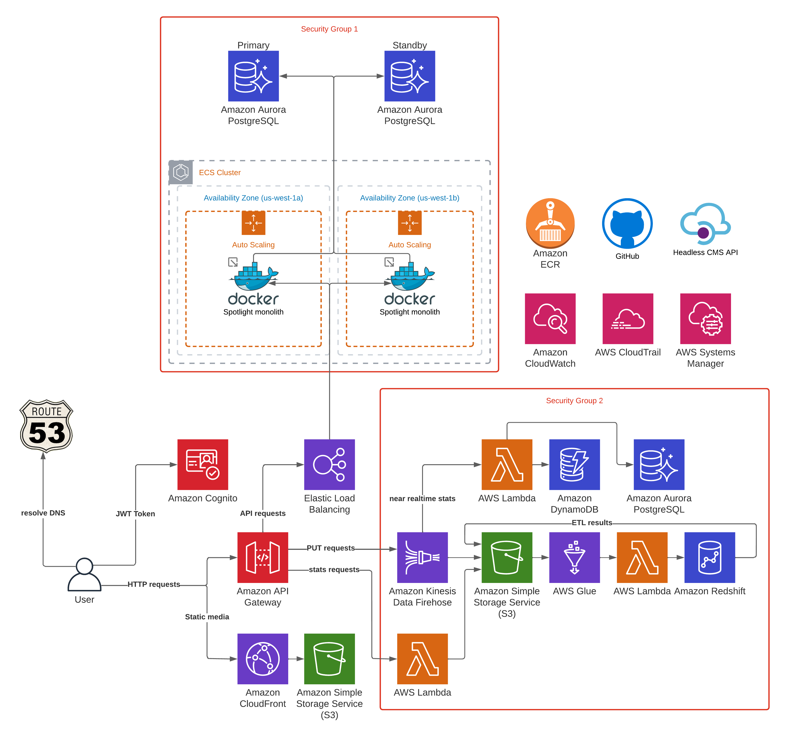

[> Home](../README.md)  [> Solution](README.md)

[< Prev](2.4.Security.md)  |  [Next >](2.6.Roadmap.md)

# Deployment

We picked AWS ECS service with reserved (for critical workload) and spot instances (for irregular workload).

- ECS will enable us to use Docker as local and production environment
- Reserved instances will save money in a long run, we need to calculate all needed resources in advance;
- Spot instances will save money for CI/CD pipelines and heavy recommended calculations, where short restart due to eviction is not that critical;

One of the key thing while using AWS is to carefully pick instance sizes and monitor costs. We need to define threshold for already spent money notifications.

### Cloud infrastructure

- AWS IAM - to manage cloud infrastructure permissions
- AWS Cognito - to manage user pools for OAuth
- AWS ECS - to serve monolith workload in a scalable manner
- AWS ECR - to keep deployment artifacts (docker images)
- AWS Aurora PostgreSQL (burst tX instances for staging, normal rX for production workload)
- AWS S3 - to be a ephemeral mutable disk for docker containers, store assets and keep processed data
- AWS Systems Manager - to keep credentials in its vault
- AWS API Gateway - to serve and proxify requests
- AWS Elastic Load Balancer - to balance the load between AZ
- AWS Route53 - to register DNS and MX records
- AWS SES with configured DKIM/DMARC domain, to send transactional emails
- AWS Lambda - to send push notifications, render PDFs, process reporting and analytics data
- AWS Glue - to run periodical ETL transformations on schedule
- AWS Kinesis Data Firehose - to batch data for further processing
- AWS Cloudwatch - to collect logs
- AWS Cloudtrail - to trace application requests
- AWS VPC - to isolate critical infrastructure
- AWS Amplify - to run headless CMS

### External software

- Issue tracker, Jira
- CI/CD platform, Github Actions

### Spotlight Operations

- Forum board, to build a place for community discussions
- Headless CMS to manage content
- Standalone community platform (whitelabel)

### Third-party integrations

- Zoom, to organize videocalls between candidates and mentors, NPOs and community leaders
- Google Calendar/Apple Calendar, to schedule a call
- Sentry, to track user errors

---

[< Prev](2.4.Security.md)  |  [Next >](2.6.Roadmap.md)
