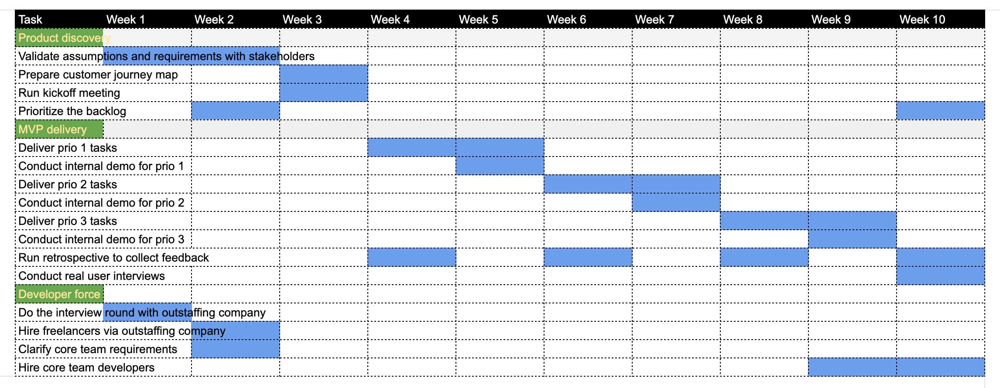

[> Home](../README.md)  [> Solution](README.md)

[< Prev](2.5.Deployment.md)  |  [Next >](2.7.Reporting.md)

---

# Project Roadmap

We split our delivery into two phases to limit a scope and increase the possibility that value will be generated:

1. Workable Minimum Viable Product (MVP)
2. Post-MVP enhancements

## MVP Phase

> A minimum viable product (MVP) is a concept from Lean Startup that stresses the impact of learning in new product development

There are list of features we want to deliver within MVP phase. They will allow us to validate _early_ all the assumptions made.
Done in parallel with user testing sessions, it will help us to save money and attract more resources for development from investors.

| Feature | Business value | Priority  |
| --- | --- | --- |
| Service Taxonomy | Manage service offering hierarchy | `prio 1` |
| Community management | Register communities and get in touch with candidates early | `prio 1` |
| NPO signup flow | Onboard NPOs to the platform  | `prio 1` | 
| Candidate signup | Learn about candidate experience and needs |  `prio 2` | 
| NPO recommender service | Match candidates assessment with NPO services | `prio 2` | 
| Meetings service | Arrange and manage meetings with candidates and NPOs | `prio 2` | 
| Evaluations service | Assess candidate skills and visualize learning progress |  `prio 3` | 
| Notifications service | Improve candidate engagement via recalling him with emails/push notifications | `prio 3` | }
| User management | Interact with system (login/logout, set & validate user permissions) | `prio 3` | 

## Post-MVP Phase

### Achievements

Allows candidates and NPOs to visualize and gamify their experience

### Video service

Allows to automate videocalls between candidates and NPOs, NPOs and community leaders

---

[< Prev](2.5.Deployment.md)  |  [Next >](2.7.Reporting.md)
