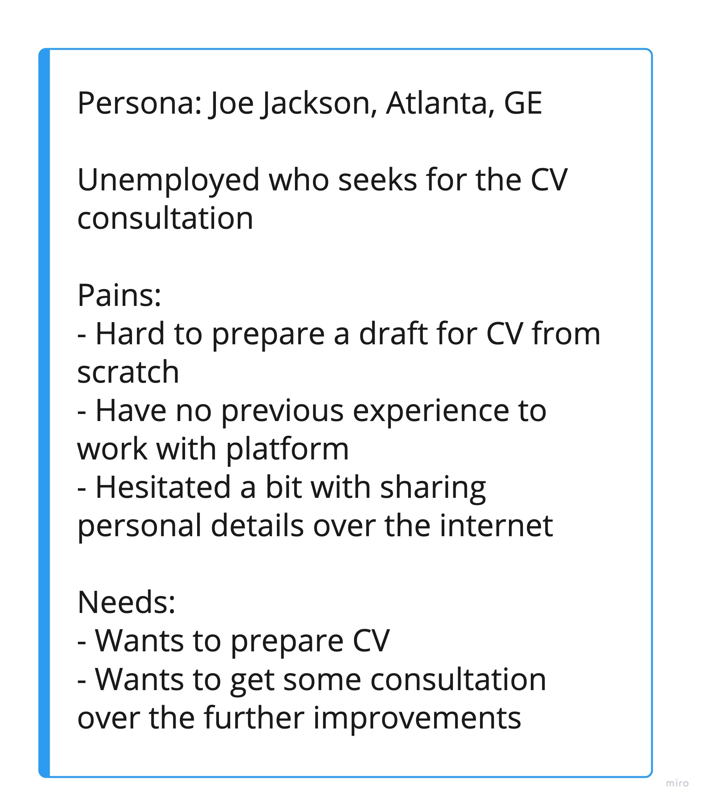

[> Home](../README.md)  > User Stories

[< Prev](../2.Solution/README.md)  |  [Next >](../4.Views/README.md)

---

# User Stories

> A user story is a short, simple description of a feature told from the perspective of the person who desires the new capability, usually a user or customer of the system. User stories typically follow a simple template:

As a < type of user >, I want < some goal > so that < some reason >.

Below we presented our user stories for:
- [NPO Admin](NPOAdmin.md)
- [Mentor](Mentor.md)
- [Candidate](Candidate.md)
- [Community Leader](CommunityLeader.md) 
- [Platform Admin](PlatformAdmin.md)

## Personas

---

[< Prev](../2.Solution/README.md)  |  [Next >](../4.Views/README.md)
