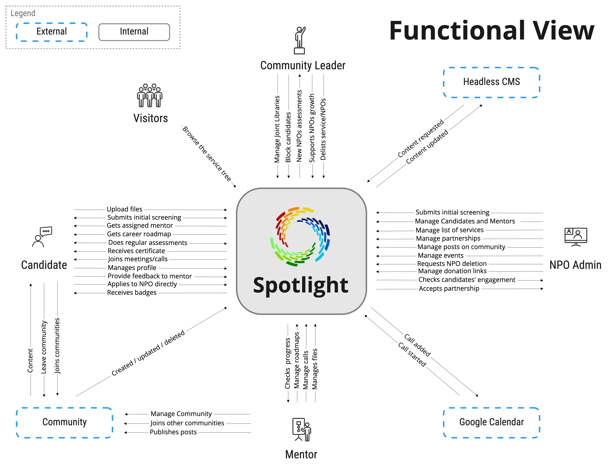

[> Home](../../README.md) [> Views](../README.md)  > Event Storming

[< Prev](../README.md)  |  [Next >](../4.2.EventStorming/README.md)

---

## Functional View of the Requirements

This view provides a good overview of the functionality of the overall system as seen by a business person. This ensures that we've captured all the major requirements. If we have not, it should be quite obvious.

To come up with this view, we consider Spotlight Platform as a black box, and determine how different real world elements interact with it.

All the boxes in this diagram are real systems and people. 

If we zoom into Spotlight Platform box we'd have our software components. From here on it makes sense to look at [C4 Models](../4.4.C4Models/README.md) to see what the software context is, what containers it has, and what components those containers contain, to provide this functionality.

---

[< Prev](../4.5.Mockups/README.md)  |  [Next >](../4.3.Scenarios/README.md)

