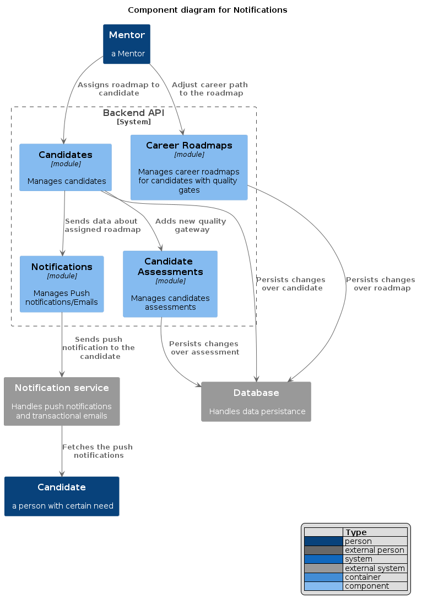

[> Home](../../README.md) [> Views](../README.md) > C4 Models

[< Prev](../4.3.Scenarios/README.md)  |  [Next >](../4.5.Mockups/README.md)

---

# C4 Models
We are using [C4 Model](https://c4model.com/) to build our models.   

> The C4 model is a way to help software development teams describe and communicate software architecture.
> In order to create these maps of your code, we first need a common set of abstractions to create a ubiquitous language 
> that we can use to describe the static structure of a software system. The C4 model considers the static structures of 
> a software system in terms of containers, components and code. And people use the software systems that we build.

## Level 1. System Context
> Level 1: A System Context diagram provides a starting point, showing how the software system in scope fits into the world around it.

## Level 2. Container
> Level 2: A Container diagram zooms into the software system in scope, showing the high-level technical building blocks.

## Level 3. Component
> Level 3: A Component diagram zooms into an individual container, showing the components inside it.

### Notifications components and interactions

## Level 4. Code (skipped)
> Level 4: A code (e.g. UML class) diagram can be used to zoom into an individual component, showing how that component is implemented.

(skipped)

---
> We have used Str to build C4 models
> C4 model using a textual domain specific language (DSL).
> [Structurizr DSL](https://github.com/structurizr/dsl)
> [spotlight-c4](../../assets/spotlight-c4.dsl)
___ 
> We have used plantuml to build our C4 diagrams, which can be found in [assets](../../assets/plantuml),
> using following [templates](https://github.com/plantuml-stdlib/C4-PlantUML).

---

[< Prev](../4.3.Scenarios/README.md)  |  [Next >](../4.5.Mockups/README.md)
