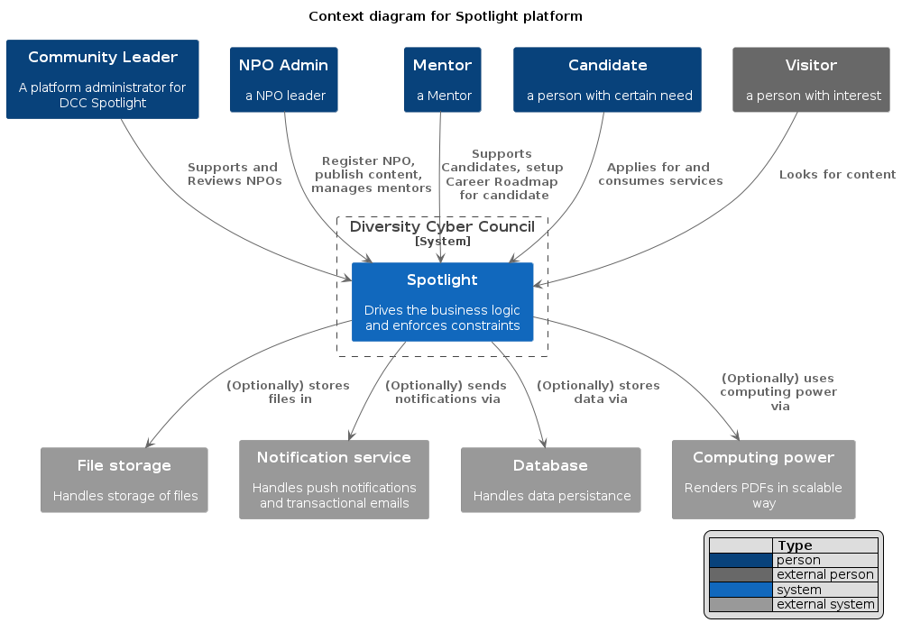
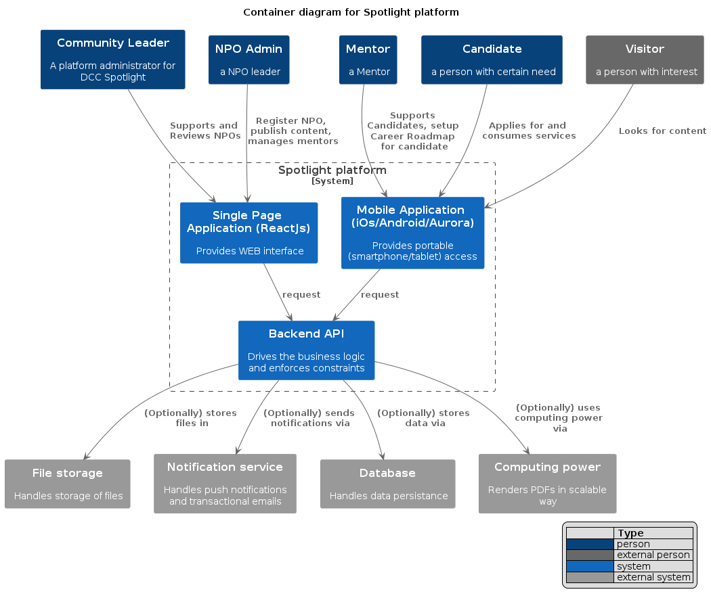

[> Home](../../README.md) [> Views](../README.md)  [> C4 Models](README.md)  
[< Prev](../4.3.Scenarios/README.md)  |  [Next >](../../5.ADRs/README.md)

# C4 Models

## Level 1. System Context

## Level 2. Container

## Level 3. Component

## Level 4. Code (skipped)

[> Home](../../README.md) [> Views](../README.md)  [> C4 Models](README.md)  
[< Prev](../4.3.Scenarios/README.md)  |  [Next >](../../5.ADRs/README.md)
