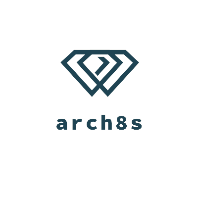

  
  <h1>Team <strong>Arch8s</strong></h1>
  <b>O'Reilly Architectural Kata: Spring 2022</b>

 

Hi there! 👋 We are team <b title="Archistratigs">Arch🎱s</b> and we are glad to present our solution to the announced Kata!

## 📖 Table of Contents

[🧑‍🚀 Glossary](Glossary.md)

[Problem Background](1.Problem/README.md)

- [ ] [Business Goals, Drivers & Requirements](1.Problem/1.1.BusinessGoalsDriversAndRequirements.md)
- [ ] [Stakeholder Concerns](1.Problem/1.2.StakeholderConcerns.md)
- [ ] [Architecture Analysis](1.Problem/1.3.ArchitectureAnalysis.md)
- [ ] [Actors, Actions & Significant Scenarios](1.Problem/1.4.ActorsActionsAndSignificantScenarios.md)
- [ ] [Constraints](1.Problem/1.5.Constraints.md)
- [ ] [Assumptions](1.Problem/1.6.Assumptions.md)
- [ ] [RAID Log](1.Problem/1.7.RAID.md)

[Solution Background](2.Solution/README.md)

- [ ] [Architecture Principles](2.Solution/2.1.ArchitecturePrinciples.md)
- [ ] [Overall Architecture Style Analysis](2.Solution/2.2.ArchitectureCharacteristics.md)
- [ ] [Conceptual System Design](2.Solution/2.3.Conceptual.md))
- [ ] [Data Store Solution](2.Solution/2.4.DataStore.md)
- [ ] [Security](2.Solution/2.5.Security.md)
- [ ] [Deployment](2.Solution/2.6.Deployment.md)
- [ ] [Roadmap](2.Solution/2.7.Roadmap.md)
- [x] [ADRs](5.ADRs/README.md)

[User Stories](3.UserStories/README.md)

- [ ] [NPO staff](3.UserStories/NPO/Staff/CRUD.md)
- [ ] [Candidates](3.UserStories/Candidate/CRUD.md)
- [ ] [Platform Admins](3.UserStories/Platform/Admin/CRUD.md)

[Views & Perspectives](4.Views/README.md)

- [ ] [Functional View](4.Views/FunctionalView/README.md)
- [ ] [Event Storming](4.Views/EventStorming/README.md)
- [ ] [Scenario Flow Diagrams](4.Views/Scenarios/README.md)
- [ ] [C4 Models](4.Views/C4Models/README.md)

## Resources 

- [x] [O'Reilly Architecture Katas](https://learning.oreilly.com/featured/architectural-katas/)
- [x] [Diversity Cyber Council](https://www.diversitycybercouncil.com/)
- [x] [2022 Architecture Katas Requirements](assets/docs/diversitycybercouncilkatarequirements20221653334648065.pdf)
- [x] [Updated requirements](https://docs.google.com/document/d/1XjEpcGJ87xYg1eWN9eE0_tH7te5HcVAgPvoONLHY4qQ/edit?usp=sharing)

## References

# Team ✨

Thanks goes to these wonderful people:

- [Ivan Georgiev](https://www.linkedin.com/in/ivan-georgiev-859b219/)
- [Andrey Orsoev](https://www.linkedin.com/in/andreyorsoev)
- [Kavya Shiva](https://www.linkedin.com/in/kavyashiva)
- [Moran Lefler](https://www.linkedin.com/in/moranlefler/)
- [Renu Kumari](https://www.linkedin.com/in/renu-kumari-827b8293/)

## Extras

[Clarifications](Clarifications.md)

---
